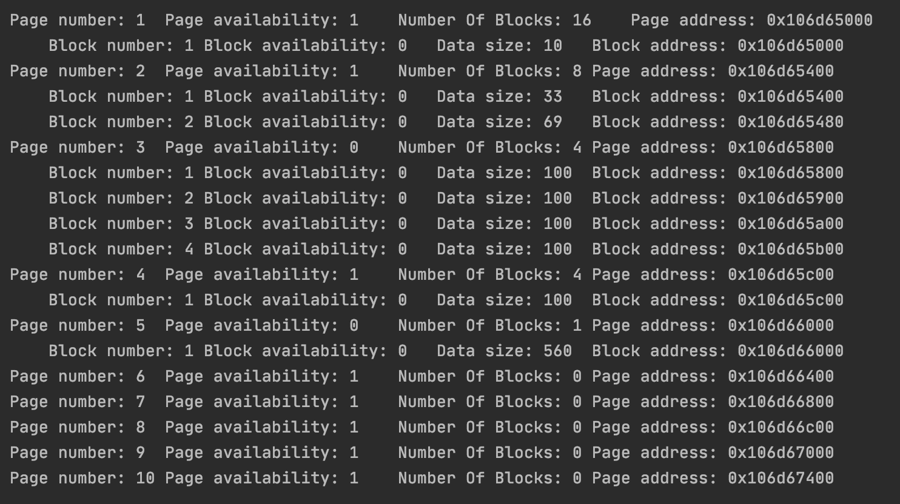

# page-allocator
Page memory allocator is a variant of memory allocator where all virtual memory is made up of pages. Each page can be located in RAM or in an external file (pages that have been accessed at least once, i.e. pages for which virtual memory resources have been allocated) are considered.
When accessing a page located in an external file, a page miss occurs and the operating system finds a free physical page and reads the content from the external file into it. The page size is usually 4 KB to several MB. Thus, if in the process of making a decision the memory allocator refers to fewer pages, the less it leaves a trace in memory, the more efficient it is.
As in lab # 1, the memory allocator requests a certain area of memory from the operating system. Further, all this memory is divided into pages. The page size does not have to be the same as the virtual page size. For example, one virtual one can contain several pages of the allocator. All pages are aligned, so when accessing data at any address within the page, we refer to only one virtual page.
### Algorithm description
#### `void* mem_alloc(size_t size)` function
When allocating a block of memory of a certain size, 3 situations are considered:
1. Block size less than half the page size
2. Block size is more than half the page (total_size> (PAGE_SIZE / 2) && total_size <PAGE_SIZE)
3. Block size is larger than page size (total_size> PAGE_SIZE)
In the first case, the block size is rounded to the next power of 2 to determine the page class and the page and block are initialized
In the second case, the block will occupy the entire page.
And in the third case, one block will occupy several pages, several full pages and 1 page will contain the remainder
#### `void mem_free(void* addr)` function
To free a block, this block is searched for at the address by iterating over all pages and addresses.
If this is the only block in the page, it is assigned the status of free, otherwise only the block in the page is marked free.
#### `void* mem_realloc(void* addr, size_t size)` function
Realloc() changes the size of the given memory block to the size given.
We first get the block’s header and see if the block already has the size to accomodate the requested size. If it does, there’s nothing to be done.
If the current block does not have the requested size, then we call malloc() to get a block of the request size, and relocate contents to the new bigger block using memcpy(). The old memory block is then freed.
### Examples
#### Example of `mem_alloc(size_t size)` function
##### Description
Allocation 10, 33, 69, 100, 100, 100, 100, 100, 560 bytes

##### Code
```
    page_malloc(10);


    void* test = page_malloc(33);

    page_malloc(69);
    page_malloc(100);
    page_malloc(100);
    page_malloc(100);
    page_malloc(100);
    page_malloc(100);
    page_malloc(560);
```
##### Picture

#### Example of `mem_free(void* addr)` function
##### Description
Free block test
##### Code
`page_free(test);`
##### Picture


#### Example of `mem_alloc(void* addr, size_t size)` function
##### Description
Realloc
##### Code
``
page_realloc(test, 33);
``
##### Picture

